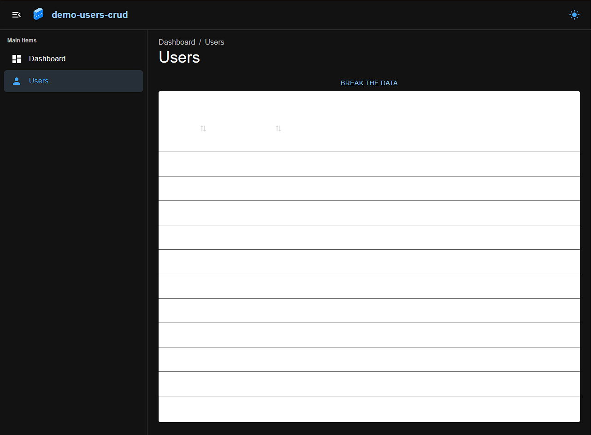

## Getting Started

First install dependencies: `pnpm install`

Then run the development server: `pnpm run dev`

Open [http://localhost:5173](http://localhost:5173) with your browser to see the result.

## Description

First of all theme is broken for a table, I did not bother to fix it, so please switch to light theme manually

Now here's how to emulate broken API

